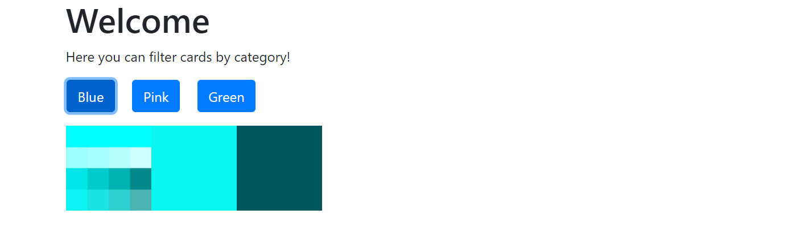

# Placeholder Image Widget

# Installation

1. Install the `BitsOrchestra.FilterByCategory.Kentico.MVC` NuGet Package to your MVC Site

# Widget

There is one widget, `Filter by category` which allows to have all the pages with specific path, page type and one parent category filtered by its category.
For using this widget, you have to create page type with the following fields - name (optional), image, category (to select one of the available categoties).

Using the widget properties, you can choose path to the parent page, enter page type, choose parent category and add css classes to filter buttons and images. 

For example - you have category "Colors" and child categories "Blue", "Green", "Pink". So, you create pages, assign them to one of these category and you will be able to filter these pages images by its category. For parent category in widget property should be chosen "Colors".

# Contributions, bug fixes and license

Feel free to Fork and submit pull requests to contribute.

You can submit bugs through the issue list and I will get to them as soon as I can, unless you want to fix it yourself and submit a pull request.

This is free to use and modify.

Check the License.txt for License information

# Compatability

Can be used on any Kentico 12 SP site (hotfix 67 or above).
